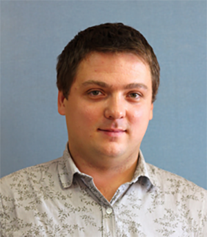

<!-- Имя и фамилия -->
Sergey Glushakov
================

<!-- Фото -->


<!-- Контакты для связи -->
Contacts:
----------

+ **tel** _+79295266240_
+ **skype** _Margo301983_
+ **email** _sergey_glushakov_web@mail.ru_
+ **telegram** _https://t.me/sergey_glushakov_

<!-- Краткая информация о себе (ваша цель и приоритеты, подчеркните свои сильные стороны, расскажите о своём опыте работы, если опыта работы нет, расскажите о своём стремлении учиться и узнавать новое) -->
About me:
-----------------

I am a novice front end developer from Moscow.Web development for me is more than a job, it is a very interesting and creative process. And the more I dive into the world of web development, the more I like it. My goal is to become a sought-after specialist.

<!-- Навыки (языки программирования, фреймворки, методологии, системы контроля версий и инструменты разработки, которыми вы владеете) -->
Tech - Skills:
--------------

+ **HTML**
+ **CSS(SCSS)**
+ **JS**
+ **PUG**
+ **PHOTOSHOP**
+ **FIGMA**
+ **AVOCODE**
+ **GIT**

Soft - Skills:
--------------

+ **Communication**
+ **Teamwork**
+ **Self-Motivation**
+ **Responsibility**
+ **Flexibility**


<!-- Примеры кода -->
An example of my code:
-------------------------

```
sections.articles__main
    .iarticles.articles
        .container
            .iarticles__top
                h1.title.iarticles__title Статьи
            iarticles__bottom
                ul.iarticle__list
                    each i in article
                        li.iarticle__item
                            a(href="article.html").iarticle__link
                                h3.iarticle__title=i.title
                                .iarticle__descr
                                    p !{i.descr}
```
<!-- Опыт работы. Junior Dev может перечислить учебные проекты с указанием использованных навыков и ссылками на исходный код. -->
Work experience:
------------------

There will be links to future works here...


<!-- Образование (включая пройденные курсы и тренинги) -->
Education
------------------

| Year of study         | Educational institution                                           | Specialization      |
|-----------------------|-------------------------------------------------------------------|---------------------|
| ***2002 - 2004***     | __Gomel College of Trade and Economics__ __Gomel__ __Belarus__    | ***Accountant***    |
| ***2009 - 2014***     | __Finance and Humanities Academy__ __Moscow__ __Russia__          | ***Economist***     |
|                       |                                                                   |                     |
<!-- Английский язык (уровень английского языка, если была языковая практика, расскажите о ней) -->
Languages
------------------
English - A1
